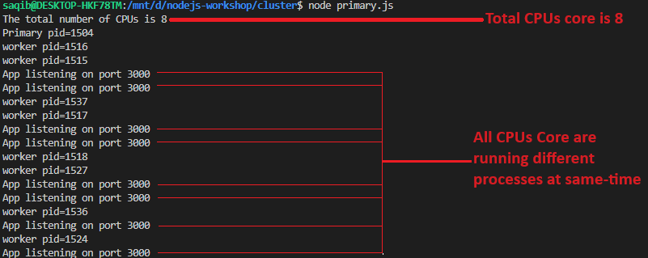
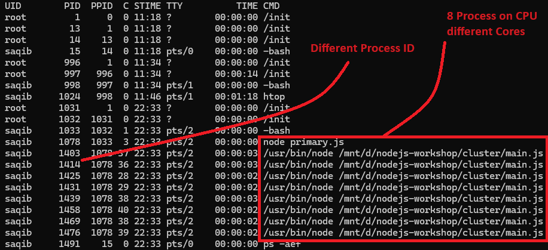

# Node.js cluster module implementation 

Following is the code implementation of cluster module
```
import cluster from "cluster";
const cpuCount = os.cpus().length;
```

Run the node program by typing node primary.js on terminal



To verify the No.s of process at operation system level, use the following command.

```
$ ps -aef
```
